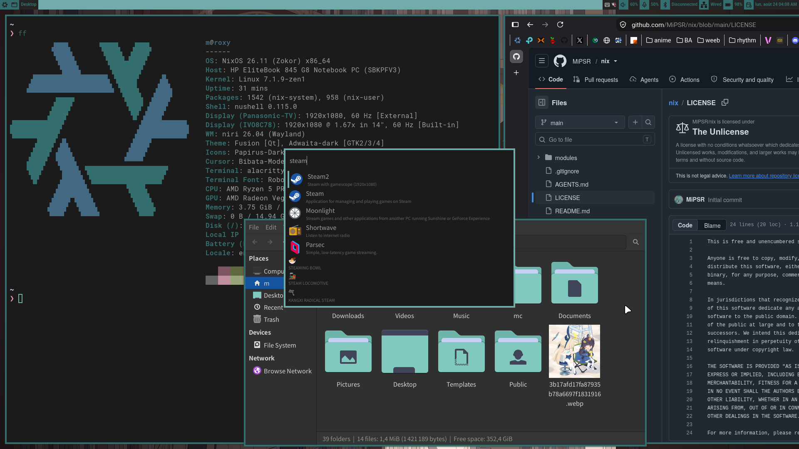

# NixOS configurations

This repository contains my personal NixOS configurations for various machines.

## Machines

### Laptop: roxy
An **HP EliteBook 845 G8** laptop with a **Ryzen 5 5650U**.
Mainly used as a **Moonlight** client that plays gacha and rhythm games, and handles software development with Nix shells.

## Usage

Machines are bound to one of two **profiles** (`server`, `laptop`)
via `mkHost` in `flake.nix`.

Nix **Flakes** manage the configurations, automatically selecting the correct
machine recipe based on the **hostname**.

## Shared across machines
- **GDM**.
- **Linux Zen** kernel.
- **Niri** with **Wayle**, installed system-wide with a default configuration.
- Dark theming from a custom **OKLCH palette** (`modules/palette.nix`).
- Locale is set to `en_US.UTF-8`, with regional settings in `fr_FR`.

## Shell aliases

Defined for the **Nushell** shell.

### SCRCPY
* `phn`: launches **SCRCPY** with my personal settings.

### Desktop maintenance
* `fix-audio`: restarts PipeWire and PipeWire PulseAudio.
* `restart-sunshine`: kills and restarts Sunshine.

### NixOS management
* `nf`: updates the flake lock from `~/code/nix`.
* `ns`: rebuilds the system from `~/code/nix` and applies it instantly.
* `nb`: rebuilds the system from `~/code/nix` and applies it after reboot.
* `nt`: rebuilds the system from `~/code/nix` and applies it temporarily.
* `cln`: cleans the system by removing old generations and optimising the Nix store.

### Laziness
* `ff`: `fastfetch`.
* `la`: list all files (`ls -a`).
* `ll`: list files in long format (`ls -l`).
* `lla`: list all files in long format (`ls -la`).
* `overdo`: `sudo`.
